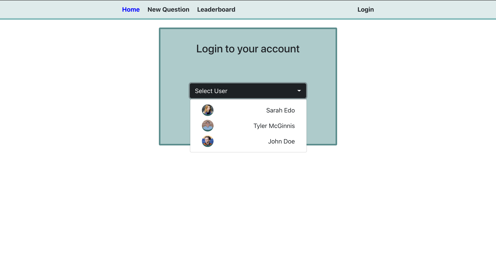
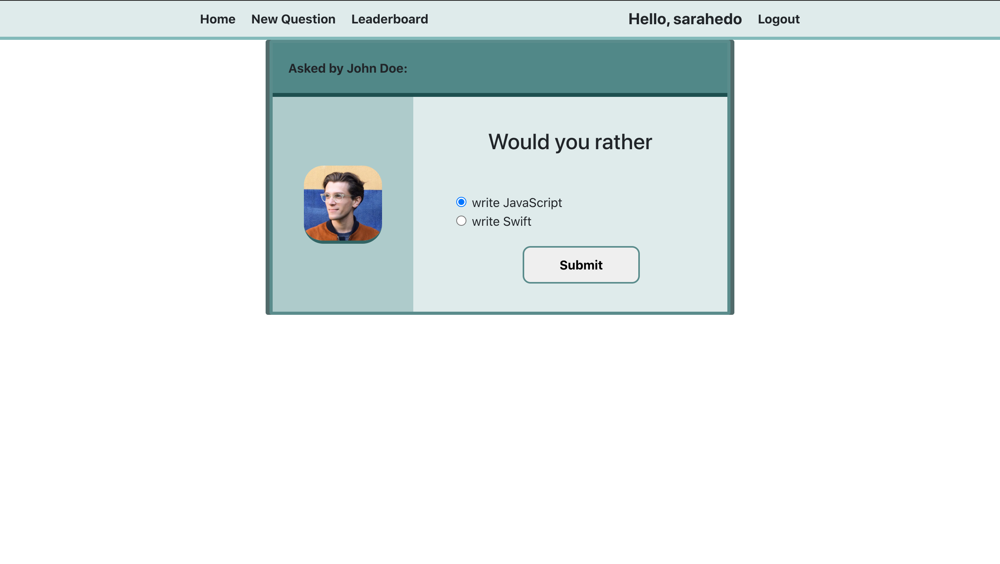
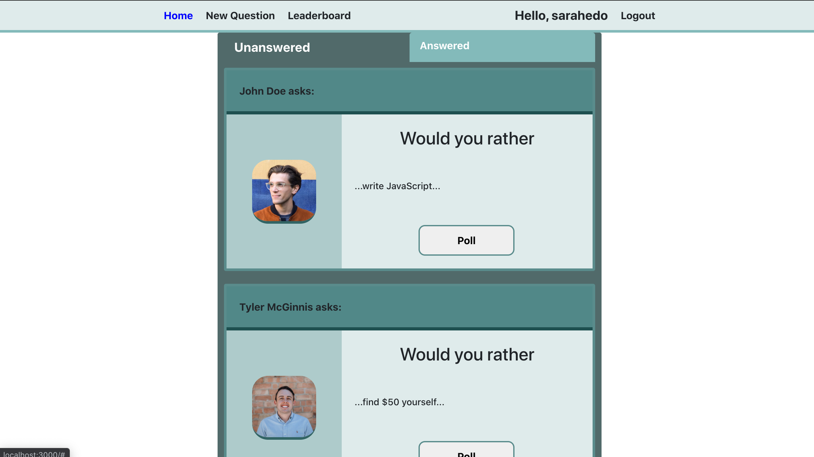

# Would You Rather Project

This project was created for Udacity's React-Redux course final.  The objective was to
use the redux store to be able to create a manageable single-page application.
In this application the user can view polls and vote.  The user can also create polls, and view a
leaderboard. The app has the functionality of logging in as different users, with the same data being
shown regardless of user.

## installing
simply run npm install to install all project dependencies
npm start to run the server

## Contributing

This repository is the starter code for *all* Udacity students. Therefore, we most likely will not accept pull requests. For details, check out [CONTRIBUTING.md](https://github.com/udacity/reactnd-project-would-you-rather-starter/blob/master/CONTRIBUTING.md).

### Screenshots

